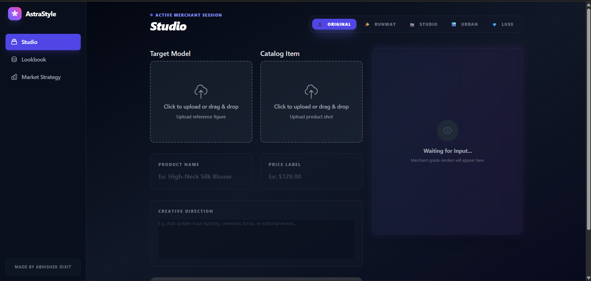

# 🌟 AstraStyle: Professional AI Virtual Try-On for Merchants

AstraStyle is a high-end, merchant-focused web application that leverages the power of **Google Gemini API** to transform e-commerce photography. It allows fashion brands to generate photorealistic virtual try-ons while simultaneously crafting complete marketing strategies in seconds.



## ✨ Features

### 📸 Pro-Grade Virtual Try-On
- **Gemini 2.5 Flash Image Integration:** Seamlessly swaps garments from product shots onto human models with high fidelity.
- **Strict Identity Preservation:** Advanced prompting ensures the model's face, skin tone, hair, and body proportions remain 100% authentic to the original reference photo.
- **Contextual Lighting:** Matches shadows and light sources between the new garment and the environment for a non-artificial look.

### 🎨 Digital Studio & Presets
- **Instant Environments:** Change the vibe of your shoot with one click using presets:
  - **Runway:** High-fashion spotlights.
  - **Urban:** Natural city daylight.
  - **Studio:** Minimalist professional backdrop.
  - **Luxury:** High-end boutique/penthouse aesthetic.
- **Creative Direction:** Custom text input for fine-tuning lighting, mood, and style.

### 🧠 Merchant Asset Intelligence
Beyond just images, AstraStyle acts as a consultant using **Gemini 3 Flash**:
- **Styling Strategy:** Actionable tips for footwear, accessories, and grooming.
- **Catalog Copy:** Professional, SEO-optimized web store descriptions.
- **Social Media Hooks:** Engagement-ready Instagram captions and hashtags.
- **Market Appeal:** Insights into target demographics and look-feel analysis.

### 📁 Asset Lookbook & Strategy
- **Persistent Archive:** Store up to 5 high-resolution renders locally for quick comparison.
- **Growth Blueprint:** A dedicated strategy dashboard highlighting KPI targets like 85% cost reduction and 42% conversion lift.

## 🛠️ Tech Stack

- **Frontend:** React 19, TypeScript
- **Styling:** Tailwind CSS (Custom "Midnight" Theme)
- **AI Engine:** `@google/genai` (Google Gemini SDK)
  - **Vision:** `gemini-2.5-flash-image`
  - **Intelligence:** `gemini-3-flash-preview`
- **State Management:** React Hooks & LocalStorage for asset persistence.

## 🚀 Getting Started

### Prerequisites
- A Google Gemini API Key from [Google AI Studio](https://aistudio.google.com/).

### Installation
1. Clone the repository:
   ```bash
   git clone https://github.com/your-username/astrastyle.git
   ```
2. Set up your environment variable:
   - The app expects `process.env.API_KEY` to be configured.
3. Run the application:
   ```bash
   npm install
   npm start
   ```

## 🎥 Merchant Showcase Workflow

1. **Upload Reference:** Start with a photo of a person (the model).
2. **Upload Product:** Add a flat-lay or ghost-mannequin photo of the garment.
3. **Select Preset:** Choose "Runway" or "Urban" for the desired mood.
4. **Generate:** Let the AI engineer the visual asset and marketing strategy.
5. **Analyze:** Review the Asset Intelligence for styling and social media hooks.
6. **Save & Deploy:** Add to your Lookbook and download for your storefront.

## 📄 License

This project is open-source. Created by **Abhishek Dixit**.

---

*“Instant style at the speed of light.”*
